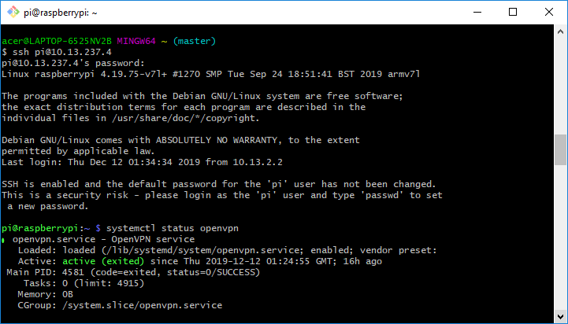

ip: 10.13.237.4

ssh mode de passe: raspberry
 
connexion vpn client :  100419831004Amir
 

###  Serveur OpenVPN sur Debian

## I. Introduction

OpenVPN est une application VPN open source qui vous permet de créer et de rejoindre un réseau privé en toute sécurité sur Internet public. En bref, cela permet à l'utilisateur final de masquer les connexions et de naviguer en toute sécurité sur un réseau non approuvé

## Étape 1 - Installez OpenVPN

•	Avant d'installer des packages, mettez à jour l'index des packages apt.
  apt-get update
  apt-get update
•	Maintenant, nous pouvons installer le serveur OpenVPN avec easy-RSA pour le chiffrement.
 apt-get install openvpn easy-rsa

## Etape 2- Cinfigurer OpenVPN

•	L'exemple de fichier de configuration du serveur VPN doit être extrait dans /etc/openvpn afin que nous puissions l'intégrer dans notre configuration. Cela peut être fait avec une seule commande :

  gunzip -c /usr/share/doc/openvpn/examples/sample-config-files/server.conf.gz> /etc/openvpn/server.conf

•	Une fois extrait, ouvrez le fichier de configuration du serveur à l'aide de nano ou de votre éditeur de texte préféré.

       nano /etc/openvpn/server.conf
•	nous définirons les autorisations dans server.conf

        /etc/openvpn/server.conf
•	Décommentez à la fois l’user nobody et le group nogroup . Cela devrait ressembler à ceci une fois terminé : 
   
user nobody group nogroup

## Étape 3 - Activer le transfert de paquets

Dans cette section, nous dirons au noyau du serveur de transférer le trafic des services clients vers Internet. Sinon, le trafic s'arrêtera sur le serveur.
 
•	Activez le transfert de paquets pendant l'exécution en entrant cette commande :
  echo 1> / proc / sys / net / ipv4 / ip_forward

•	Ensuite, nous devrons le rendre permanent afin que ce paramètre persiste après un redémarrage du serveur. Ouvrez le fichier de configuration sysctl utilisant nano ou votre éditeur de texte préféré.

 nano /etc/sysctl.conf

•	En haut du fichier sysctl , vous verrez:

etc/openvpn/server.conf

Uncomment the next line to enable packet forwarding for IPv4 #net.ipv4.ip_forward=1

## Étape 4 - Installer et  configurer ufw

•	UFW est un frontal pour IPTables. Nous avons seulement besoin de faire quelques règles et modifications de configuration. Ensuite, nous activerons le pare-feu. Comme référence pour plus d'utilisations d'UFW, voir Comment configurer un pare-feu avec UFW sur un serveur Ubuntu et Debian Cloud .
•	# Tout d'abord, installez le package ufw .

                  apt-get install ufw
•	Deuxièmement, définissez UFW pour autoriser SSH:

ufw enable
ufw allow 22
ufw allow 1194

•	L'activation d'UFW renverra l'invite suivante :
             Command may disrupt existing ssh connections. Proceed with operation (y|n)?
•	Répondez y . Le résultat sera cette sortie:

•	Pour vérifier les règles de pare-feu principal d'UFW:
                   statut ufw

## Étape 5 - Configurer et créer l'autorité de certification

•	OpenVPN prend en charge l'authentification bidirectionnelle basée sur des certificats, ce qui signifie que le client doit authentifier le certificat de serveur et que le serveur doit authentifier le certificat client avant d'établir une confiance mutuelle. Pour ce faire, nous utiliserons les scripts d'Easy RSA.

•	créez un répertoire pour héberger la clé.
     mkdir / etc / openvpn / easy-rsa / keys
    
•	définir les paramètres de notre certificat. Ouvrez le fichier de variables à l'aide de nano ou de votre éditeur de texte préféré.
        nano / etc / openvpn / easy-rsa / vars
        
•	Ensuite, nous générerons les paramètres Diffie-Helman à l'aide d'un outil OpenSSL

 openssl dhparam -out /etc/openvpn/dh2048.pem 2048
 
•	Faites attention au point (.) Et à l' espace devant la commande ./vars . Cela signifie le répertoire de travail actuel (source).
   .  ./vars
   ./Nettoie tout
   . /build-ca

## Étape 6 - Générez un certificat et une clé pour le serveur

Tout d'abord, toujours à partir de /etc/openvpn/easy-rsa , /etc/openvpn/easy-rsa votre clé avec le nom du serveur. Cela a été spécifié précédemment sous le nom KEY_NAME dans votre fichier de configuration. La valeur par défaut de ce didacticiel est server . 

ca /etc/openvpn/easy-rsa/keys/ca.crt
cert /etc/openvpn/easy-rsa/keys/AEK.crt
key /etc/openvpn/easy-rsa/keys/AEK.key
dh /etc/openvpn/easy-rsa/keys/dh2048.pem

 •	Dans cette section, nous allons configurer et lancer notre serveur OpenVPN.
       Serveur ./build-key-server

## Étape 7 - Déplacer les certificats et les clés du serveur

Nous allons maintenant copier le certificat et la clé dans /etc/openvpn , car OpenVPN recherchera dans ce répertoire l'autorité de certification, le certificat et la clé du serveur. 
cp / etc / openvpn / easy-rsa / keys / { server .crt, server .key, ca.crt} / etc / openvpn

   copier le certificat et la clé dans /etc/openvpn ,
   
•	vérifier que la copie a réussi avec:

     ls / etc / openvpn
•	le serveur OpenVPN est prêt à fonctionner. Démarrez-le et vérifiez l'état.

     openvpn start
     
•	état du service openvpn

## Étape 8 - Générer des certificats et des clés pour les clients 

Jusqu'à présent, nous avons installé et configuré le serveur OpenVPN, créé une autorité de certification et créé le certificat et la clé du serveur. Dans cette étape, nous utilisons l'autorité de certification du serveur pour générer des certificats et des clés pour chaque appareil client qui se connectera au VPN. 

Comme nous l'avons fait avec la clé du serveur, nous en client1 maintenant une pour notre exemple client1 . Vous devriez toujours travailler sur /etc/openvpn/easy-rsa . 

  ./build-key client1
  
  
 # Ensuite, nous allons copier la clé générée dans le répertoire des keys Easy-RSA que nous avons créé précédemment. Notez que nous changeons l'extension de .conf en .ovpn . C'est pour correspondre à la convention. 
  
   cp /usr/share/doc/openvpn/examples/sample-config-files/client.conf /etc/openvpn/easy-rsa/keys/client.ovpn
   
  # Nous devons modifier chaque fichier client pour inclure l'adresse IP du serveur OpenVPN afin qu'il sache à quoi se connecter. Ouvrez client.ovpn utilisant nano ou votre éditeur de texte préféré. 
   
     nano / etc / openvpn / easy-rsa / keys / client.ovpn
     
     Tout d'abord, modifiez la ligne commençant par remote . Remplacez my-server-1 par your_server_ip . 
     
     client
dev tun
proto udp
remote 10.13.237.4 1194
resolv-retry infinite
nobind
persist-key
persist-tun
remote-cert-tls server
tls-version-min 1.2
verify-x509-name raspberrypi_10447801-a6b3-43fb-a819-e1762c050060 name
cipher AES-256-CBC
auth SHA256
auth-nocache
verb 3
<ca>
  
  /etc/openvpn/easy-rsa/keys/client.ovpn 
  
  The hostname/IP and port of the server. # You can have multiple remote entries # to load balance between the servers. remote your_server_ip 1194 
  
  
 ## Transfert de certificats et de clés vers les appareils clients 
Rappelez-vous à partir des étapes ci-dessus que nous avons créé les certificats et clés client, et qu'ils sont stockés sur le serveur OpenVPN dans le /etc/openvpn/easy-rsa/keys . 
Pour chaque client, nous devons transférer les fichiers de certificat client, de clé et de modèle de profil vers un dossier sur notre ordinateur local ou un autre périphérique client. 
Dans cet exemple, notre appareil client1 nécessite son certificat et sa clé, situés sur le serveur dans: 

/etc/openvpn/easy-rsa/keys/ client1 .crt 
/etc/openvpn/easy-rsa/keys/ client1 .key 

Les fichiers ca.crt et client.ovpn sont les mêmes pour tous les clients. Téléchargez également ces deux fichiers; notez que le fichier ca.crt trouve dans un répertoire différent des autres. 
/etc/openvpn/easy-rsa/keys/client.ovpn 
/etc/openvpn/ca.crt 

Voici un exemple de commande SCP utilisant notre exemple client1 . Il place le fichier client1.key dans le répertoire Téléchargements sur l'ordinateur local. 

  scp root @ your-server-ip: /etc/openvpn/easy-rsa/keys/client1.key Téléchargements /
  
  
  À la fin de cette section, assurez-vous que vous disposez de ces quatre fichiers sur votre appareil client : la deux clients  
` client1 .crt` 
` client1 .key` 
  client.ovpn 
  ca.crt 

ip: 10.13.237.4

ssh mode de passe: raspberry
 
connexion vpn client :  100419831004Amir

