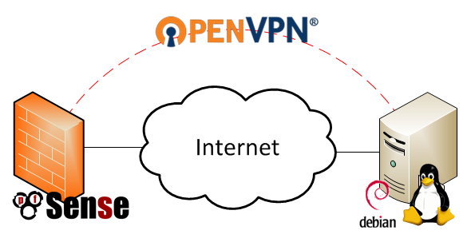

ip: 10.13.237.4

mode de passe: raspberry

Serveur OpenVPN sur Debian

I. Introduction

OpenVPN est une application VPN open source qui vous permet de créer et de rejoindre un réseau privé en toute sécurité sur Internet public. En bref, cela permet à l'utilisateur final de masquer les connexions et de naviguer en toute sécurité sur un réseau non approuvé
Étape 1 - Installez OpenVPN
•	Avant d'installer des packages, mettez à jour l'index des packages apt.
  apt-get update
  apt-get update
•	Maintenant, nous pouvons installer le serveur OpenVPN avec easy-RSA pour le chiffrement.
#  apt-get install openvpn easy-rsa

Etape 2- Cinfigurer OpenVPN

•	L'exemple de fichier de configuration du serveur VPN doit être extrait dans /etc/openvpn afin que nous puissions l'intégrer dans notre configuration. Cela peut être fait avec une seule commande :
 #   gunzip -c /usr/share/doc/openvpn/examples/sample-config-files/server.conf.gz> /etc/openvpn/server.conf

•	Une fois extrait, ouvrez le fichier de configuration du serveur à l'aide de nano ou de votre éditeur de texte préféré.
      #   nano /etc/openvpn/server.conf
•	nous définirons les autorisations dans server.conf 
      #   /etc/openvpn/server.conf
•	Décommentez à la fois l’user nobody et le group nogroup . Cela devrait ressembler à ceci une fois terminé : 
#    user nobody group nogroup

Étape 3 - Activer le transfert de paquets

Dans cette section, nous dirons au noyau du serveur de transférer le trafic des services clients vers Internet. Sinon, le trafic s'arrêtera sur le serveur.
 
•	Activez le transfert de paquets pendant l'exécution en entrant cette commande :
  echo 1> / proc / sys / net / ipv4 / ip_forward

•	Ensuite, nous devrons le rendre permanent afin que ce paramètre persiste après un redémarrage du serveur. Ouvrez le fichier de configuration sysctl utilisant nano ou votre éditeur de texte préféré.

#  nano /etc/sysctl.conf

•	En haut du fichier sysctl , vous verrez:
#  etc/openvpn/server.conf
Uncomment the next line to enable packet forwarding for IPv4 #net.ipv4.ip_forward=1

Étape 4 - Installer et  configurer ufw

•	UFW est un frontal pour IPTables. Nous avons seulement besoin de faire quelques règles et modifications de configuration. Ensuite, nous activerons le pare-feu. Comme référence pour plus d'utilisations d'UFW, voir Comment configurer un pare-feu avec UFW sur un serveur Ubuntu et Debian Cloud .
•	Tout d'abord, installez le package ufw .
                  #  apt-get install ufw
•	Deuxièmement, définissez UFW pour autoriser SSH:
# ufw enable
# ufw allow 22
# ufw allow 1194

•	L'activation d'UFW renverra l'invite suivante :
             Command may disrupt existing ssh connections. Proceed with operation (y|n)?
•	Répondez y . Le résultat sera cette sortie:

•	Pour vérifier les règles de pare-feu principal d'UFW:
                  #  statut ufw

Étape 5 - Configurer et créer l'autorité de certification

•	OpenVPN prend en charge l'authentification bidirectionnelle basée sur des certificats, ce qui signifie que le client doit authentifier le certificat de serveur et que le serveur doit authentifier le certificat client avant d'établir une confiance mutuelle. Pour ce faire, nous utiliserons les scripts d'Easy RSA.

•	créez un répertoire pour héberger la clé.
    #    mkdir / etc / openvpn / easy-rsa / keys
•	définir les paramètres de notre certificat. Ouvrez le fichier de variables à l'aide de nano ou de votre éditeur de texte préféré.
       #  nano / etc / openvpn / easy-rsa / vars
•	Ensuite, nous générerons les paramètres Diffie-Helman à l'aide d'un outil OpenSSL

#  openssl dhparam -out /etc/openvpn/dh2048.pem 2048
•	Faites attention au point (.) Et à l' espace devant la commande ./vars . Cela signifie le répertoire de travail actuel (source).
#    .  ./vars
#  ./Nettoie tout
.#  /build-ca

Étape 6 - Générez un certificat et une clé pour le serveur

•	Dans cette section, nous allons configurer et lancer notre serveur OpenVPN.
      #  Serveur ./build-key-server

Étape 7 - Déplacer les certificats et les clés du serveur

#  copier le certificat et la clé dans /etc/openvpn ,
•	vérifier que la copie a réussi avec:
#    ls / etc / openvpn
•	le serveur OpenVPN est prêt à fonctionner. Démarrez-le et vérifiez l'état.
#    openvpn start
•	état du service openvpn

