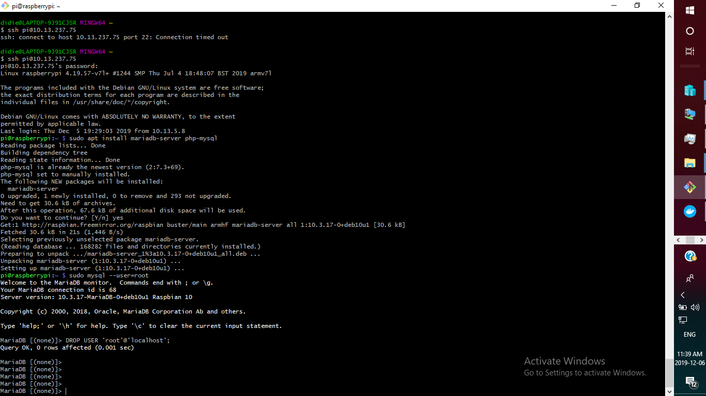

## :loop:  MES PREMIERS PAS SUR RASPBERRY PI     

### Utilite de raspberry pi
Le Raspberry pi est un nano ordinateur que l'on peut brancher à un ecran et utilise comme un ordinateur standard. Il est utilise 
pour la creation d'un serveur Web chez soi. Pour sa pour sa taille il ne faut pas s'attendre a des performances incroyables, mais pour mettre en ligne des projets a montrer au client ou experimenter avec linux.

### :one: Comment se connecter a votre raspberry pi
Ouvrir le terminal git bash et se connecter a votre rasberry pi  

ssh pi@10.13.237.75

### :two: Faire une mise a jour  de votre rasberry pi avant toute installation

Avant toute installation il convient de faire une mise a jour de votre nano ordinateur en entrant la commande:  

$ sudo apt-get update

### :pushpin: ETAPES DE CONFIGURATION LAMP SUR RASPBERRY PI

En rappel l'accronyme LAMP= Linux, Apache, Mysql et PHP

### :pushpin: INSTALLATION LINUX
Rasppberry integre deja le systeme linux tout commentaire serait une perte de temps.
Il convient de configurer votre raspberry pi en l'attribuant une adresse ip et un mot de passe.
La commande pour configurer l'adress est la suivante: if config

### :pushpin: INSTALLATION DE MARIA DB ON YOUR RASPBERRY PI
- MySQL est une base de donnees relationnelle (SGBDR) qui a vu le jour en 1995, creee par Michael Monty Widenius et David Axmark. Elle a ete cree lorsque le marche éeait domine par Microsoft et les solutions proprieeaires d’Oracle.
- Qu’est-ce que MariaDB
 MariaDB a eu sa première version en octobre 2009, avec la version 5.1.38 Béta, basée sur MySQL 5.1.38. C’était un fork destine a  s’assurer que la base de code MySQL serait libre pour toujours. 

Pour installer MARIA DB sur rasberry pi:

### :one: Commande d'installation Maria DB 
Nous pouvons installer MariaDB avec la commande suivante:

~#   apt install mariadb-server

### :two: Creation de la base des bases de donnes comanydb et wikidb

mysql> CREATE DATABASE wikidb;

### :three: Creation d'un utlisateur et octroyer des privileges 

- utilisateur et des privileges pour la base de donnes companydb

les commandes ci-dessous permettent de creer un utilisateur et lui octroyer des privileges sur maria db

mysql> CREATE USER 'root'@'localhost' IDENTIFIED BY 'password';

mysql> GRANT ALL PRIVILEGES ON *.* TO 'root'@'localhost' WITH GRANT OPTION;

### :four: Acceder a la base de donnees par la commande suivante: 

Pour acceder a la base il faut ta per la commande c-apres et utiliser le password approprie
$ mysql -u root -p

### :five: Capture d'ecran

### :pushpin: Installation PHP

### :one: c'est quoi PHP

PHPsignifie Hypertext Preprocessor est un langage de programmation libre, principalement utilise pour produire des pages Web dynamiques via un serveur HTTP, mais pouvant également fonctionner comme n'importe quel langage interprétede faon locale.

### :two: Installation PHP
Pour installer php il faut entrer les 2 commande suivante:

 $ apt install php 
 
 $ apt install libapache2-mod-php  
 
 ### :three: C'est quoi un fichier php 
 
 le fichier php est une extension de nom de fichier php qui peremet de faire des tests de connectivite avec le Web Apache
 
la commande ci-dessous en mode super utilisateur pour sauvegarder l'extension php

 nano /var/www/html/testmyphp.php

Copier l'extension PHP dans via puis sauvegarder 

<?php
phpinfo();
?>

Ctrl + o pour enregistrer et Ctrl + x pour sortir 

#### :four: Comment Tester la connectivite de php

- Ouvrir un explorer et taper l'adresse suivante sur un explore

10.13.237.75/testmyphp.php

### :five: Capture d'ecran d'un test de connectivite reussi

### :pushpin: INSTALLATION DE APACHE  SUR RASPBERRY PI

### :one:  C'est quoi apache
### :one: Enter la commande suivante dans git bash pour installer  
 # apt install php
 ### Specifier la version version php a installer
 
 # apt install libapache2-mod-php
### :two Creer un nouveau fichier avec la commande ci-dessous:

- Verifier la la connectivite apache

On peut verifier la connectivite apache en tapant 10.13.237.75 sur un explorer

~$ wget -O verif_apache.html http://127.0.0.1

Nous pouvons tester l'installation de php en ouvrant un explorer 
10.13.237.75/testmyphp.php

 - copier l'adress et configurer wiki sur un explorer: 
 
 10.13.237.75/index.php
 
http://10.13.237.75/index.php/Main_Page

 
### :pushpin: C'est quoi un 

C'est une immense encyclopedie (au meme titre qu'une encyclopedie papier).
Elle possede des dizaines de milliers d'articles sur differents sujets (societe, sante, mathematiques, informatique, litterature...) dans differentes langues (la majorite des articles sont en anglais, mais on en trouve aussi beaucoup en français, allemand, espagnole...)

### :one: INSTALLER MEDIAWIKI SUR RASBERRY PI

Pour extraire le fichier d'installation directement sur votre serveur via la ligne de commande, vous pouvez cliquer avec le bouton droit sur le lien Telecharger, selectionner Copier l'adresse du lien et coller l'adresse dans une fenêtre de terminal avec le programme
- pour installer wiki, il faut excecuter la commande suivante dans le terminal git bash

$ wget https://releases.wikimedia.org/mediawiki/1.30/\

mediawiki-1.30.0.tar.gz      

### :two: Excecutioin de la commande tar
la commmane ci-dessous permet de creer un nouveau repertoire contenant tous les fichiers et repertoires en copiant toute cette hierarchie de repertoires a l'emplacement du système de fichiers ou il fera son travail.
Pour mon cas MediaWiki va etre la seule application Web hebergee sur notre rasberry pi, ce qui  signifie qu'il est notre repertoire racine Web. Pour creer un nouveau repertoire il excecuter la commande suivante:

 .$ tar xzvf mediawiki-1.30.0.tar.gz

 vous souhaiterez peut-etre creer un sous-repertoire à la racine du document qui exposera le service de maniere
 pratique et previsible. ceci place les fichiers dans un repertoire appele / var / www / html / mediawiki /. La commande ci dessous 

~# cp -r mediawiki-1.30.0/* /var/www/html

Je vais installer les deux packages et utiliser systemctl pour redémarrer Apache:

~#  apt install php7.0-mbstring php7.0-xml

~# systemctl restart apache2

http://10.13.237.75/index.php/Main_Page

,,,,,
