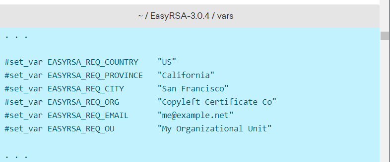
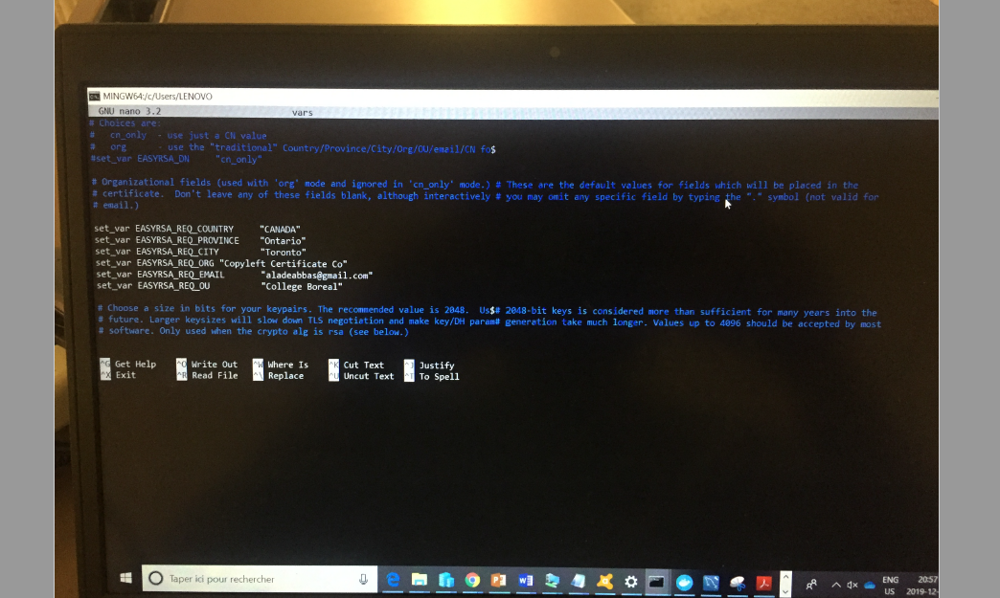

# Comment configurer un serveur OpenVPN sur Debian 


## :one:  Installer OpenVPN et EasyRSA

:pushpin: Pour commencer installer les pacquet de notre serveur VPN ET OpenVPN:

```
$ sudo apt update
$ sudo apt install openvpn
```

*Emettre des certificats:VPN TLS / SSL

:pushpin: Pour ce faire, nous téléchargerons la dernière version de EasyRSA, que nous utiliserons pour construire notre infrastructure de clé publique CA (PKI), à partir du référentiel GitHub officiel du projet:


[🎥] 

```
$ wget -P ~/ https://github.com/OpenVPN/easy-rsa/releases/download/v3.0.4/EasyRSA-3.0.4.tgz
```


:pushpin: Apres telechargement il faut l'archiver:
```
$ cd ~
$ tar xvf EasyRSA-3.0.4.tgz

```
Apres installation de tout les logiciels passons a l'etape 2.

### :two: Configuration des variables EasyRSA et création de l'autorité de certification

:pushpin: Sur home acceder au repertoire EasyRSA :

```
$ cd ~/EasyRSA-3.0.4/

```
Sur ce repertoire acceder au fichier  nommé vars.example
Faites une copie de ce fichier et nommez-la vars sans extension de fichier:


```
$ cp vars.example vars

```
-Ouvrez ce nouveau fichier en utilisant votre éditeur de nano que moi je prefere:

```
$ nano vars

```





Recherchez les paramètres qui définissent les valeurs par défaut des champs pour les nouveaux certificats. Cela ressemblera à ceci:


:m: Décommentez ces lignes et mettez à jour les valeurs surlignées





ctrl O pour save et ctrl x pour exit 

Ensuite, on lance la séquence qui va générer les clés (.key) et les
certificats (.crt) :
```
$ cd /etc/openvpn/easy-rsa/

```
```
$ source vars

```
```
$ ./clean-all

```
```
$ ./build-dh

```

```

$ ./pkitool --initca

```
```
$ ./pkitool --server server

```
```

$ openvpn --genkey --secret keys/ta.key

```
Il faut ensuite copier les clés et les certificats utiles pour le serveur
VPN dans le répertoire /etc/openvpn/ :
```

$ cp keys/ca.crt keys/ta.key keys/server.crt keys/server.key keys/dh1024.pem /etc/openvpn/

```
Pour des raisons de sécurité, il faut créer un répertoire 
dans lequel le processus OpenVPN sera chrooté. Il faut aussi créer
un autre répertoire qui contiendra la configuration des clients.
```
$ mkdir /etc/openvpn/jail

```
```
$ mkdir /etc/openvpn/clientconf

```
Pour terminer, on créé le fichier de configuration
/etc/openvpn/server.conf

```
$ nano /etc/openvpn/server.conf

```

Copiez ensuite les lignes suivantes dans ce fichier :


:pushpin: Serveur TCP/443

```

mode server

proto tcp

port 443

dev tun


```
:pushpin: Clefs et certificats

```

ca ca.crt

cert server.crt

key server.key

dh dh1024.pem

tls-auth ta.key 0

cipher AES-256-CBC

```

:pushpin: Reseau

``
server 10.8.0.0 255.255.255.0
push "redirect-gateway def1 bypass-dhcp"
push "dhcp-option DNS 4.4.4.4"
push "dhcp-option DNS 8.8.8.8"
keepalive 10 120

``

 :pushpin: Securité

``
user nobody
group nogroup
chroot /etc/openvpn/jail
persist-key 
BEDDES Jérémy
Mémos Personnels
persist-tun
comp-lzo

``

:pushpin: Log
```
verb 3
mute 20
status openvpn-status.log
; log-append /var/log/openvpn.log

```

 :M: L’adresse IP est bien sur à adapter.
Le point-virgule est important en fin de fichier, nous l’enlèverons par
la suite lorsque le serveur sera activé.
Le fichier de configuration que nous venons de créer permet de créer
un serveur VPN sécurisé avec SSL. Il est basé sur le protocole TCP et
utilise le port 443 (HTTPS). Dans l’exemple de ce fichier, les clients
auront une IP dans la plage d’adresse de 10.8.0.0/24 (à adapter en
fonction de vos besoins).

Testons la configuration :

```
$ cd /etc/openvpn

$ openvpn server.conf

```
Si vous obtenez le message « Initialization Sequence Completed » (ou
un message similaire), votre serveur démarrera correctement.
Maintenant vous pouvez enlever le point-virgule du fichier de
configuration.

Démarrons le serveur :
```
$ /etc/init.d/openvpn start

```
Vos machines clientes vont maintenant pouvoir se connecter au
serveur VPN. Par contre il sera impossible d’aller plus loin que le
serveur VPN puisque l’adresse 10.0.8.X n’est pas routée hors du hors du
serveur.

Configuration du routage :
``
:pushpin:  sh -c ‘echo 1 > /proc/sys/net/ipv4/ip_forward’

```
Pour que ce paramétrage de routage soit permanent, il faut ajouter
la ligne suivante au fichier /etc/sysctl.conf
net.ipv4.ip_forward = 1
Puis il faut configurer la translation d’adresse (NAT) :
```
:pushpin: iptables -t nat -A POSTROUTING -s 10.8.0.0/24 -o eth0 -j MASQUERADE

```
Pour que cette règle de NAT soit persistante après un reboot du
serveur, il faut utiliser un script existant :

```
:pushpin: sh -c ‘’iptables-save > /etc/iptables.rules’’

```
Puis il faut éditer le fichier /etc/network/interfaces pour y ajouter la
ligne suivante après la définition de l’interface réseau principale
(iface, inet, eth0 par exemple).
pre-up iptables-restore < /etc/iptables.rules


