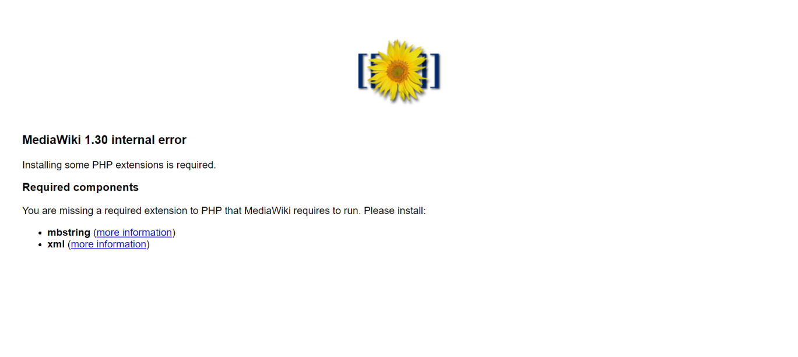
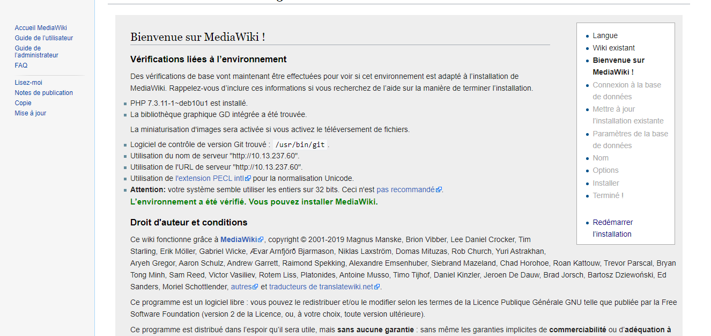
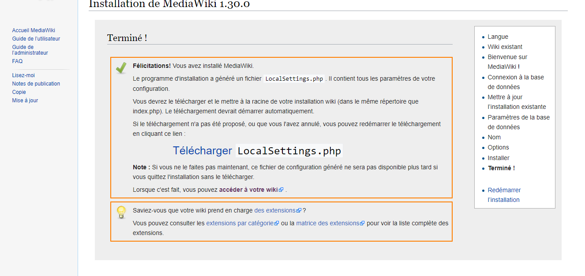
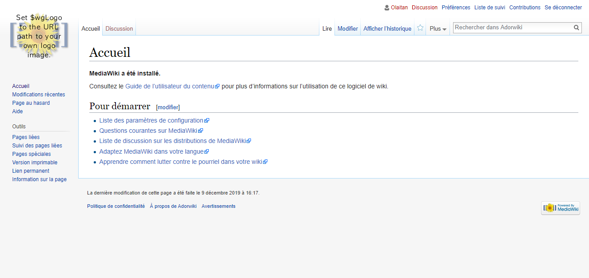

                                               🔎 Web servers 
                                       Building  a MediaWiki server ( Chap 7 )
                                       
   😊 MediaWiki est un logiciel libre orienté serveur, disponible sous licence Licence publique générale GNU (GNU General Public License - GPL). Il est conçu pour fonctionner dans une ferme composée de nombreux serveurs, hébergeant un site web pouvant avoir plusieurs millions de clics par jour.
MediaWiki est un logiciel extrêmement puissant, adaptable à souhait et permettant une implémentation de wiki aux fonctionnalités riches. Il utilise PHP pour interpréter et afficher les données contenues dans une base de données de type MySQL notamment.
Les pages utilisent le format wikitexte de MediaWiki ; ainsi les utilisateurs peuvent contribuer facilement sans avoir de connaissance en HTML ou CSS.

                                              🎾 Building a LAMP server
                                              Statique ou Dinamique SiteWeb?
😀 LAMP est un acronyme pour Linux, Apache, MySQL, PHP. C'est une pile logicielle comprenant le système d'exploitation,
un serveur HTTP, un système de gestion de bases de données et un langage de programmation interprété, et qui permet de mettre en place un serveur web.
   Le serveur LAMP est une configuration Linux tellement courante qu'Ubuntu, au moins, a son propre métapaquet d'installation.Le signe d'insertion (^) à la fin de cet exemple identifie la cible comme un paquet spécial regroupé pour simplifier l'installation de piles logicielles communes : 
   
   $ sudo apt install lamp-server^
   
   Cette commande, après vous avoir demandé de créer un mot de passe de base de données, déposera automatiquement un serveur Web fonctionnel sur votre système, vous laissant avec rien d'autre à faire que de créer du contenu de site Web. Diriger votre navigateur 
   web vers l'adresse IP du serveur devrait afficher une page de bienvenue créée lors de l'installation d'Apache.
   
                                                         🙆‍♂️ Remarque
   
   Mais l'automatisation n'est pas toujours la meilleure solution.
    Parfois,vous voudrez personnaliser votre pile de logiciels en spécifiant des versions de versions particulières 
    pour assurer la compatibilité des applications,ou en substituant 
    un paquet à un autre (MariaDB sur MySQL, par exemple,comme vous allez bientôt le voir).
    La configuration manuelle sera particulièrement utile dans ce cas,car elle vous forcera à mieux comprendre 
    comment chaque bit fonctionne. 
    
    C'est l'approche que je vais adopter dans ce chapitre.
    Je vous montre la configuration manuellement.Vous avez le choix,soite vous pouvez l'installer 
    sur une machine physique ou sur une machine virtuelle(CB-DEV).
                                   
                                  
                                  
                                  👇 Voici les commandes SSH

    
    
   
   👍 Machine Physique:

$ ssh name@10.13.237.10.X 
     
     👍 Machine virtuelle (CB-DEV)

$ docker-machine ssh CB-DEV

     👍 Voici la commande Pour savoir le nom ou l'adresse IP de votre machine virtuellE

$ docker-machine ls
  
      Steps By Steps:
      
    😍 Voici une liste de ce qu'il faut faire pour atteindre votre objectif :
    
 1️⃣ Installez Apache
 
 2️⃣ Installez le langage de script PHP(7.0.0) côté serveur.

 3️⃣ Installez un moteur SQL (mysql dans ce cas)
 
 4️⃣ Installer et configurer MediaWiki
 
                                      1️⃣   Etape1: Install Apache2

Le serveur HTTP open source Apache tend à dominer le marché des serveurs Web sur toutes les plateformes. Parce qu’il est si populaire, et malgré le fait qu'Apache a de sérieux concurrents, dont Nginx (également multiplate-forme) et le IIS (qui fonctionne exclusivement sur les serveurs Windows). Alors, O Commence!

$ sudo apt update
$ sudo apt install apache2

L'URL que vous utiliserez pour accéder à un site Apache fonctionnant sur votre worksta-tion est localhost. Si, à la place, vous avez choisi de travailler sur un conteneur LXC ou une Virtual-Box VM, alors vous utiliserez l'adresse IP de la machine pour l'URL. Pour vous assurer d'avoir un accès réseau aux sites fonctionnant sur votre VirtualBox VM, assurez-vous qu'elle est configurée pour utiliser un adaptateur ponté (comme vous l'avez fait au chapitre 2).

                                              2️⃣   Etape2 : Install PHP
                                              
 L'ingrédient final de LAMP est le langage de script PHP. PHP est un outil qui peut être utilisé pour écrire vos propres applications web. Les applications PHP pré-intégrées sont souvent utilisées par des applications tierces comme MediaWiki pour accéder et traiter les ressources système. On peut donc supposer que vous aurez besoin du P dans votre serveur LAMP.

$ sudo apt install php
$ sudo apt install libapache2-mod-php
 
 Vous devriez prendre l'habitude de redémarrer Apache chaque fois que vous apportez des modifications à la configuration système d'un serveur web. Voici comment faire :
 
 vous pouvez changer aussi le fichier mais il faust recommencer Apache2

$ sudo systemctl restart apache2

Testing your PHP installation

#nano /var/www/html/testmyphp.php
<?php
phpinfo();
?>
                                 
                                 3️⃣   Etape3 : Install Mysql

A cette etape Vous devez configurer le mot de passe de votre conteneur mysql

$ sudo apt install mysql-server

Accédez à votre conteneur

$ mysql -u root -p
mysql> CREATE DATABASE wikidb;
mysql> CREATE USER 'mw-admin'@'localhost' IDENTIFIED BY 'mypassword';
mysql> GRANT ALL PRIVILEGES ON wikidb.* TO 'mw-admin'@'localhost'
                         IDENTIFIED BY 'mypassword';
mysql> FLUSH PRIVILEGES;
mysql> exit

 NOTE Si votre machine ne vous donne pas le droit de configurer le mot de passe dont vous avez besoin pour exécuter cette commande afin de configurer manuellement:

$ sudo mysql_secure_installation

Vous pouvez confirmer que la base de données est exécutée à l'aide de systemctl :

 $ sudo systemctl status mysql
? mysql.service - MySQL Community Server
Loaded: loaded (/lib/systemd/system/mysql.service;
                      enabled; vendor preset: enabled)
Active: active (running) since Wed 2018-05-02 12:26:47 UTC; 6h ago
Process: 396 ExecStartPost=/usr/share/mysql/mysql-systemd-start post
                   (code=exited, status=0/SUCCESS)
Process: 318 ExecStartPre=/usr/share/mysql/mysql-systemd-start pre
                       (code=exited, status=0/SUCCESS) 
Main PID: 395 (mysqld)
     Tasks: 28
Memory: 126.3M
            CPU: 20.413s
CGroup: /system.slice/mysql.service
           ??395 /usr/sbin/mysqld
           
           
             4️⃣  Etape4 : Installer et configurer MediaWiki

Premièrement, il faut telecharger le paquet de MediaWiki que vous peuez le faire avec ce siteweb (www.mediawiki.org/wiki/Download) ou bien avec la commande suivante :

$ wget https://releases.wikimedia.org/mediawiki/1.30/\
mediawiki-1.30.0.tar.gz

         Remarque 
     Si vous obtenez une erreur -bash: wget: Command Not Found lors de l'exécution du commande précédente,vous devrez installer wget.
L’exécution de tar sur l’archive téléchargée crée un nouveau répertoire contenant toutes les fichiers extraits et répertoires. Vous voudrez copier toute la hiérarchie de répertoires dans le répertoire emplacement du système de fichiers où il fera son travail.

$ sudo tar xzvf mediawiki-1.30.0.tar.gz
$ ls
mediawiki-1.30.0 mediawiki-1.30.0.tar.gz
$ sudo cp -r mediawiki-1.30.0/* /var/www/html/
 
Maintenant Il faut ecrire dans votre navigateur 10.13.237.X/index.php qui va vous montrer cette page :

je dois installer les composants pour finir.

J'utiliserai apt search pour voir quels paquets sont liés à mbstring.

$ sudo apt search mbstring
Sorting... Done

Full Text Search... Done

php-mbstring/xenial 1:7.0+35ubuntu6 all

MBSTRING module for PHP [default]

php-patchwork-utf8/xenial 1.3.0-1build1 all

UTF-8 strings handling for PHP

php7.0-mbstring/xenial-updates 7.0.18-0ubuntu0.16.04.1 amd64

MBSTRING module for PHP

Ensuite

$ sudo apt install php7.0-mbstring php7.0-xml
$ sudo systemctl restart apache2
$ sudo apt install php-mysql php-apcu php-imagick
$ sudo systemctl restart apache2

                Connecter MediaWiki à la base de données :
Il faut juste suivre les instructions pour la configuration

telecharger le fichier qui s'appelle LocalSetting.php et le le copier dans votre machine (vous devez faire les commande suivantes dans votre PC)

$ scp LocalSettings.php pi@10.13.237.X:/home/pi/

Apres cette commande sur votre serveur:

$ sudo cp /home/pi/LocalSettings.php /var/www/html/

Congratulation 

J'ai terminé d’installer wiki.L'adresse de connexion est:http://10.13.237.60/index.php et le resultat sera comme l'image:

