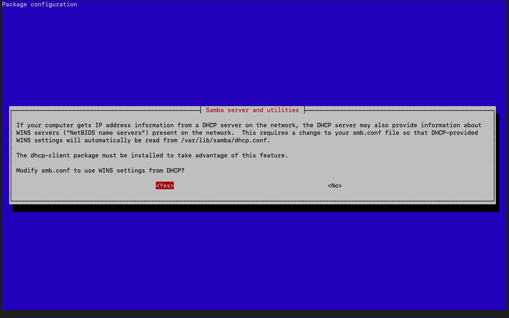

### Projet
 

 # UPDATE
 ```
 $ sudo apt update 
 ```
 
 
 # install
      
 
 
 
 $ sudo apt-get install samba
 ```
## kk
 ```
 $ nano /etc/samba/smb.conf
 ```
  ```
  $ adduser sambauser
  ```
  
   ```
 $ smbpasswd -a sambauser
   
 
 # #CONNECTION TO SERVER
 


 # #SERVEUR


 
