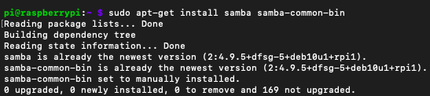
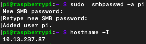
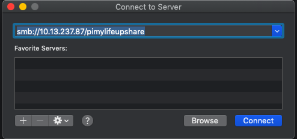
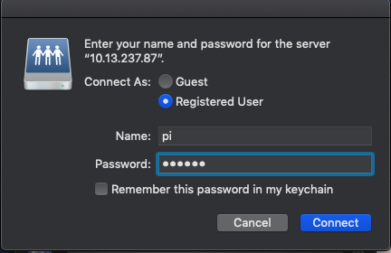
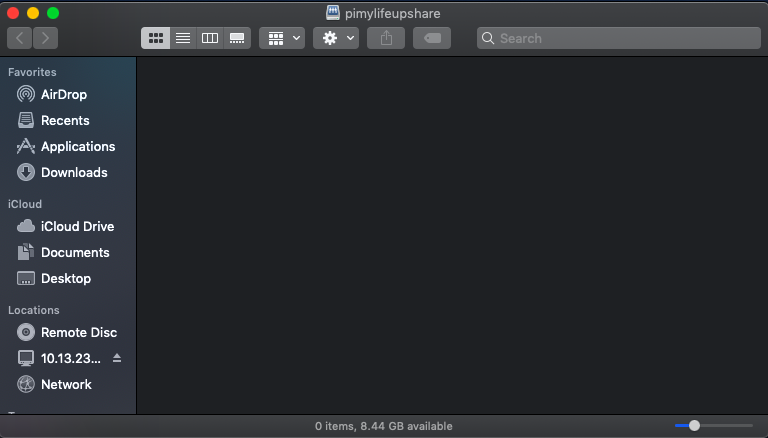

# #SAMBA PROJET
 


 # :one: INSTALLATION
 
 
 
 ```
 -$ sudo apt-get intstall samba samba-common-bin
 
 ```
       
 
 # :two: Creation du repertoire et Modification du fichier 
      
      
      - $ mkdir /home/pi/shared
        
        
      - $ sudo nano /etc/samba/smb.conf
       
  Ajout du fichier dans la configuration nano afin de 
  permettre l'acces à different utilisateur,le fichier sera 
  ajouter à la fin de la page .
   
   # :three:SET PASSWORD
   
   ```
 $ sudo smbpasswd -a pi
 ```
    -$password:joseph

 


# #CONNECT TO A SERVER
  
  
 
 
 
 
 # #PI connection
 


 # #SERVEUR


 
 
