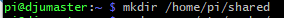
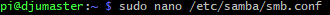
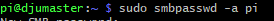
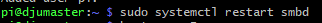
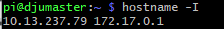
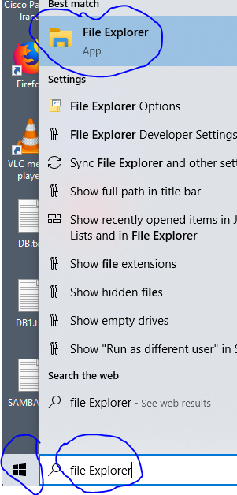
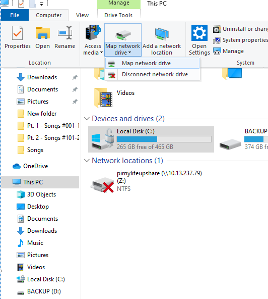
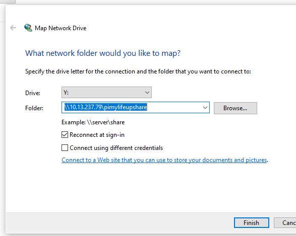

# Installation de Samba Sur un Rasberry Pi4

### :one: Se connecter sur le Rasberry Pi en ulissant SSH

````$ ssh pi@10.13.237.79````

### :two: Mettre a jour en utilisant les commandes

````sudo apt-get update & sudo apt-get upgrade````

### :three: Installer Samba

```` sudo apt-get install samba samba-common-bin````


### :four: Creer un repertoire "shared" qu'on aura a partager

````mkdir /home/pi/shared````




### :five: Modifier le fichier de configuration de Samba "smb.conf"

````sudo nano /etc/samba/smb.conf````




### :six: Ajouter cece vers la fin de la page

[pimylifeupshare]
path = /home/pi/shared
writeable=Yes
create mask=0777
directory mask=0777
public=no

:page_with_curl:
### :hash: [Pimylifeupshare]
Ceci définit le partage lui-même, le texte entre les crochets est le point auquel vous accéderez au partage. Par exemple, la nôtre sera à l'adresse suivante: // raspberrypi / pimylifeupshare

### :hash: « path » - 
Cette option est le chemin vers le répertoire de votre Raspberry Pi que vous souhaitez partager.

### :hash: « writeable »
Lorsque cette option est définie sur « Oui », cela permettra au dossier d'être inscriptible.

### :hash: «create mask» et « directory mask » - 
Cette option définit les autorisations maximales pour les fichiers et les dossiers. La définition de 0777 permet aux utilisateurs de lire, d'écrire et d'exécuter.

### :hash: « Public »
Si ce paramètre est réglé sur « no », le Pi aura besoin d'un utilisateur valide pour accorder l'accès aux dossiers partagés.

### :seven: Se connecter sur le Rasberry Pi en ulissant SSH

### :eight: Changer le mot de passe, le mot de passe par defaut est "raspberry"

$ sudo smbpasswd -a pi



### :nine:  Redemarage de raspberry
Enfin, avant de nous connecter à notre partage Raspberry Pi Samba, nous devons redémarrer le service samba afin qu'il se charge dans nos modifications de configuration.

$ sudo systemctl restart smbd




### :keycap_ten: Exécutez la commande ci-dessous pour imprimer l'adresse IP locale du Pi.
hostname -I




### :one::one: connecter à votre Samba sous Windows 10

Commencez par ouvrir l '« file explorer ».



Cliquez sur map drive



Puis, entrez le text pour mapper le lecteur réseau

\\10.13.237.79\pimylifeupshare



### :one::two: Se connecter sur le Rasberry Pi en ulissant SSH


### :one::three: Se connecter sur le Rasberry Pi en ulissant SSH


### :one::four: Se connecter sur le Rasberry Pi en ulissant SSH


