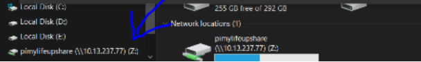

Le logiciel Samba est un outil permettant de partager des dossiers et des imprimantes à travers un réseau local. Il permet de partager et d'accéder aux ressources d'autres ordinateurs fonctionnant avec des systèmes d'exploitation Microsoft® Windows® et Apple® Mac OS® X, ainsi que des systèmes GNU/Linux, *BSD et Solaris dans lesquels une implémentation de Samba est installée.

Pour partager de manière simple des ressources entre plusieurs ordinateurs, l'utilisation de Samba est conseillée.

# projet final (installation samba sur debian et partge fichier avec windows)

##### ressources utilisees (https://pimylifeup.com/raspberry-pi-samba/)

#### :one: connection avec mon rasppberry pi depuis un terminal 
 ````$ ssh pi@10.13.237.77````
#### :two: commande d'installation en tant que superutilisateur
````$ sudo apt-get install samba samba-common-bin````
#### :three: creation du repertoire pour partager les ressources 
````$ mkdir /home/pi/partager````
#### :four: proceder à la modification du fichier de configuration samba "smb.conf" en utilisant la commande suivante
#### en tant que superuser :
````$ sudo nano /etc/samba/smb.conf````
#### :five: vous devez ajouter ses parametres à la fin de votre éditeur nano
````[pimylifeupshare]````
````path = /home/pi/partager````
````writeable=Yes````
````create mask=0777````
````directory mask=0777````
````public=no````
#### :five: à ce niveau vous devez changer le modepasse , j'ai utilisé la lettre "M" 4fois  tout en minuscule comme mot de passe .

````$ sudo smbpasswd -a pi````
#### :six: redemarrer votre samba 

````$ sudo systemctl restart smbd````
#### :seven: afficher l'addresse local du PI et l'addresse reseau

````$ hostname -I````


### connecter samba avec windows 
Ouvrir "file explorer" en le tapant dans serach de votre windows , en suite cliquer sur "this pc", en outre map derive , et à la fin rentrer:    \\votreiplocal\ puis cliquer browse vous aurez \\votreiplocal\pimylifeupshare puis ok 

### rentrer le nom d'utilisateur , c'est "pi" par defaut et votre mot de passe .
Si vous avez fait tout comme indiquer votre samba est connecter à votre ordinateur windows |

### resultat final 

